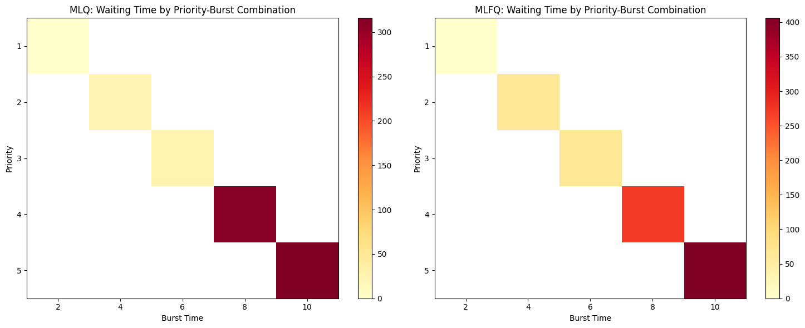
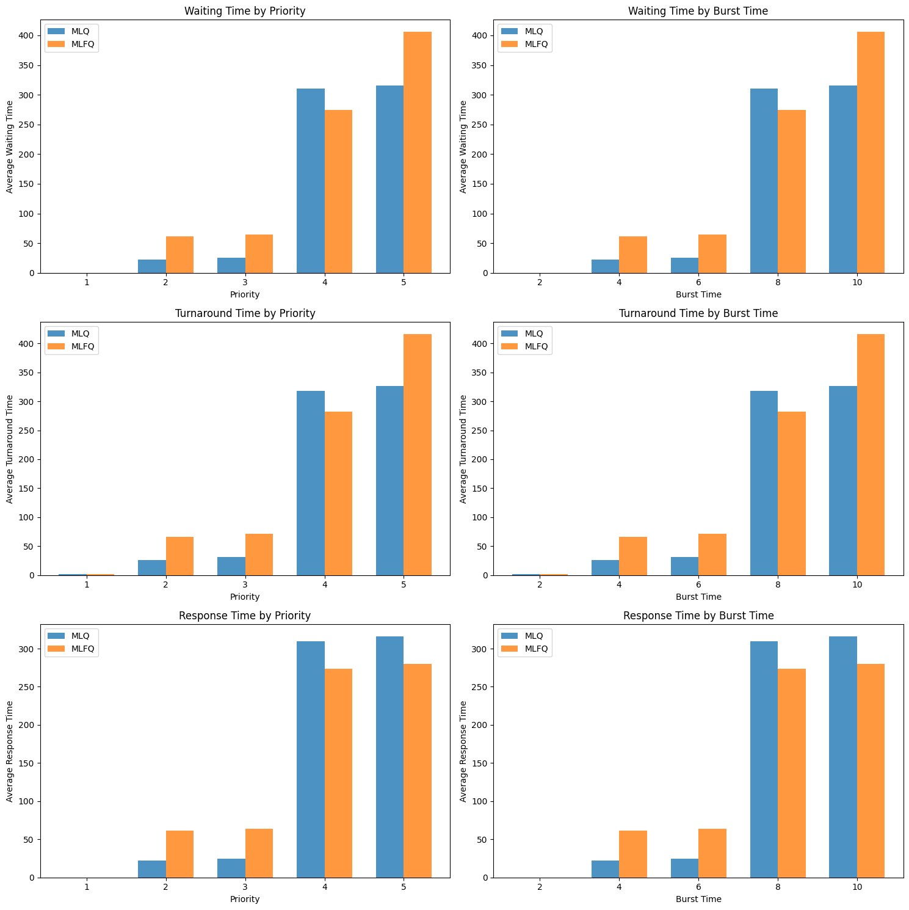
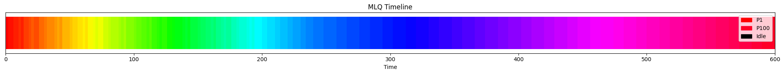
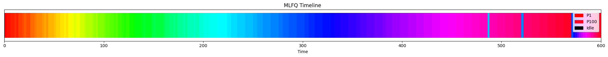
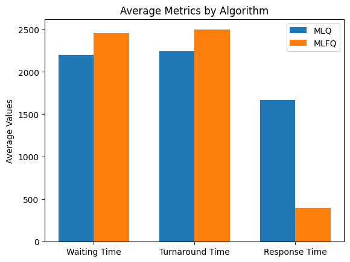
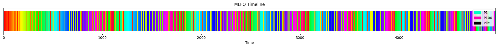
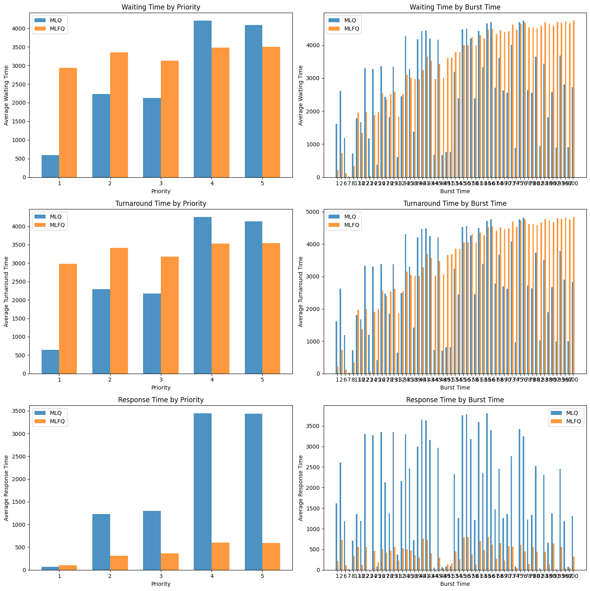

# CPU Scheduling

**Authors**: Julieta Flores y Antonio Zarco

**Course**: Operating Systems

## Overview

### 1. Multilevel Feedback Queue (MLFQ)

This scheduler divides processes into three queues based on their priority levels. Each queue uses a **time quantum** (similar to Round-Robin) for the first two queues and *FCFS* for the last queue.

- Each queue has total priority over the next one
- Processes can **move** between queues based on their behavior:
  - **Demotion**: If a process uses its full time quantum, it moves to a lower priority queue
  - **Promotion (Aging)**: If a process waits too long, it moves to a higher priority queue to prevent starvation
- Higher priority processes can **preempt** lower priority ones.

#### Design: 
- **Number of queues**: 3 queues by default (configurable)
- **Scheduling algorithm for each queue**: 
  - q0: Round-Robin-like with time quantum = 8 (demotes to q1 after quantum expires)
  - q1: Round-Robin-like with time quantum = 16 (demotes to q2 after quantum expires)
  - q2: FCFS 
- **Promotion (Aging)**: A process that waits longer than 100 time units in a lower priority queue is promoted to a higher priority queue
- **Demotion**: If a process exhausts its time quantum without completing, it is demoted to the next lower priority queue
- **Initial queue assignment**: Processes enter queues based on their priority values. The range from 0 to the maximum priority value is divided into equal parts among the queues. Lower priority values (higher priority processes) are assigned to q0, and higher priority values (lower priority processes) are assigned to q2


### 2. Multilevel Queue (MLQ)

This scheduler divides processes into three queues based on their priority levels and schedules them using *Round-Robin* within each queue.

- Processes **cannot move** between queues once assigned, but they can be **preempted** by higher priority processes.
- Quantum for queue $i$ is time_quantum $\cdot (2^i)$, meaning higher priority queues have shorter quantums.

#### Design:
- **Number of queues**: 3 queues by default (configurable)
- **Scheduling algorithm for each queue**: Round-Robin with exponentially increasing time quantums:
  - q0: Round-Robin with time quantum = 8 
  - q1: Round-Robin with time quantum = 16 
  - q2: Round-Robin with time quantum = 32 
- **Initial queue assignment**: Processes enter queues based on their priority values. The range from 0 to the maximum priority value is divided into equal parts among the queues. Lower priority values (higher priority processes) are assigned to q0, and higher priority values (lower priority processes) are assigned to q2

## Structure:

- **Process.py**: Process class with attributes and calculated metrics 
- **MultilevelQueueBase.py**: Abstract base class with common methods for queue scheduler implementations
- **MLFQ.py**: Multilevel Feedback Queue scheduler implementation
- **MLQ.py**: Multilevel Queue scheduler implementation
- **TestScheduler.py**: Test harness that runs both schedulers and generates CSV output files


## Installation


```shell
pip install -r requirements.txt
```

```shell
python TestScheduler.py < processes.txt
```

Visualize results (.csv) in jupyter notebook `metrics.ipynb`

## Output Files

Each scheduler generates 3 CSV files:
- **timeline**: Process execution timeline with queue assignments
- **metrics**: Per-process metrics (turnaround, waiting, response times)
- **summary**: Aggregate metrics. Only includes total context switches

# Comparison

We analyzed both schedulers using the metrics notebook with different process sets to understand their performance characteristics.

## Test Set 1: Small Uniform Process Set

File: metrics/examples/processes.txt

**Average Metrics:**

| Metric | MLQ | MLFQ |
|--------|-----|------|
| Waiting Time | 134.80 | 161.38 |
| Turnaround Time | 140.80 | 167.38 |
| Response Time | 134.56 | 135.98 |

**Key Findings:**
- MLQ performs better overall for this  process set


- MLFQ shows slightly better response time for low-priority processes








## Test Set 2: Large Varied Process Set

Analyzing a larger dataset with diverse priorities (1-5), arrival times (0-200) and burst times (1-100) reveals the true strengths of each algorithm:
File: metrics/examples/processes_random.txt

**Average Metrics:**

| Metric | MLQ | MLFQ |
|--------|-----|------|
| Waiting Time | 2578.28 | 2971.02 |
| Turnaround Time | 2627.42 | 3020.16 |
| Response Time | 1895.50 | 383.06 |


**Key Findings:**
- **MLFQ excels at response time** (383.06 vs 11895.50) - significantly better for interactive processes
- **MLQ excels at waiting/turnaround times** - better for batch processing
- MLFQ's aging mechanism prevents starvation but the domotion increases overall waiting time
- MLQ's priority orientation helps long high priority proccess to have better metrics







## Conclusions

### Performance Trade-offs

**MLFQ** starts new processes quickly but takes longer to complete all processes overall.

**MLQ** completes more processes in less total time but may make some processes wait longer before starting.

### Use MLFQ when:
- Interactive/responsive systems are priority
- Short processes need quick response times
- Preventing starvation is critical
- User experience matters more than total completion time

### Use MLQ when:
- Process priorities are well-defined
- Throughput is more important than response time
- High-priority processes need guaranteed performance
- System is used for batch processing rather than interactive tasks


## References

Operating System Concepts 10th Ed "ABRAHAM SILBERSCHATZ PETER BAER GALVIN GREG GAGNE"


