# Planificación de CPU

**Autores**: Julieta Flores y Antonio Zarco

**Curso**: Sistemas Operativos

## Descripción General

### 1. Cola Multinivel con Retroalimentación (MLFQ)

Este planificador divide los procesos en tres colas basándose en sus niveles de prioridad. Cada cola utiliza un **quantum de tiempo** (similar a Round-Robin) para las primeras dos colas y *FCFS* para la última cola.

- Cada cola tiene prioridad total sobre la siguiente
- Los procesos pueden **moverse** entre colas según su comportamiento:
  - **Degradación**: Si un proceso usa todo su quantum de tiempo, se mueve a una cola de menor prioridad
  - **Promoción (Envejecimiento)**: Si un proceso espera demasiado tiempo, se mueve a una cola de mayor prioridad para prevenir inanición
- Los procesos de mayor prioridad pueden **interrumpir** a los de menor prioridad.

#### Diseño: 
- **Número de colas**: 3 colas por defecto 
- **Algoritmo de planificación para cada cola**: 
  - q0: Similar a Round-Robin con quantum de tiempo = 8 (degrada a q1 después de que expira el quantum)
  - q1: Similar a Round-Robin con quantum de tiempo = 16 (degrada a q2 después de que expira el quantum)
  - q2: FCFS 
- **Promoción (Envejecimiento)**: Un proceso que espera más de 100 unidades de tiempo en una cola de menor prioridad es promovido a una cola de mayor prioridad
- **Degradación**: Si un proceso agota su quantum de tiempo sin completarse, es degradado a la siguiente cola de menor prioridad
- **Asignación inicial de cola**: Los procesos entran a las colas según sus valores de prioridad. El rango desde 0 hasta el valor máximo de prioridad se divide en partes iguales entre las colas. Los valores de prioridad más bajos (procesos de mayor prioridad) se asignan a q0, y los valores de prioridad más altos (procesos de menor prioridad) se asignan a q2


### 2. Cola Multinivel (MLQ)

Este planificador divide los procesos en tres colas basándose en sus niveles de prioridad y los planifica usando *Round-Robin* dentro de cada cola.

- Los procesos **no pueden moverse** entre colas una vez asignados, pero pueden ser **interrumpidos** por procesos de mayor prioridad.
- El quantum para la cola $i$ es quantum_tiempo $\cdot (2^i)$, lo que significa que las colas de mayor prioridad tienen quantums más cortos.

#### Diseño:
- **Número de colas**: 3 colas por defecto 
- **Algoritmo de planificación para cada cola**: Round-Robin con quantums de tiempo que aumentan exponencialmente:
  - q0: Round-Robin con quantum de tiempo = 8 
  - q1: Round-Robin con quantum de tiempo = 16 
  - q2: Round-Robin con quantum de tiempo = 32 
- **Asignación inicial de cola**: Los procesos entran a las colas según sus valores de prioridad. El rango desde 0 hasta el valor máximo de prioridad se divide en partes iguales entre las colas. Los valores de prioridad más bajos (procesos de mayor prioridad) se asignan a q0, y los valores de prioridad más altos (procesos de menor prioridad) se asignan a q2

## Estructura:

- **Process.py**: Clase Process con atributos y métricas calculadas 
- **MultilevelQueueBase.py**: Clase base abstracta con métodos comunes para implementaciones de planificadores de colas
- **MLFQ.py**: Implementación del planificador de Cola Multinivel con Retroalimentación
- **MLQ.py**: Implementación del planificador de Cola Multinivel
- **TestScheduler.py**: Arnés de pruebas que ejecuta ambos planificadores y genera archivos CSV de salida


## Instalación


```shell
pip install -r requirements.txt
```

```shell
python TestScheduler.py < processes.txt
```

Visualiza los resultados (.csv) en el notebook de jupyter `metrics.ipynb`

## Archivos de Salida

Cada planificador genera 3 archivos CSV:
- **metrics/[alg]_timeline**: Línea de tiempo de ejecución de procesos con asignaciones de cola
- **metrics/[alg]_metrics**: Métricas por proceso (tiempo de retorno, espera, respuesta)
- **metrics/[alg]_summary**: Métricas agregadas. Solo incluye el total de cambios de contexto

# Comparación

Analizamos ambos planificadores usando el notebook de métricas con diferentes conjuntos de procesos para entender sus características de rendimiento.

## Conjunto de Prueba 1: Conjunto Pequeño de Procesos Uniformes

Archivo: metrics/examples/processes.txt

**Métricas Promedio:**

| Métrica | MLQ | MLFQ |
|---------|-----|------|
| Tiempo de Espera | 134.80 | 161.38 |
| Tiempo de Retorno | 140.80 | 167.38 |
| Tiempo de Respuesta | 134.56 | 135.98 |

**Hallazgos Clave:**
- MLQ tiene mejor rendimiento general para este conjunto de procesos


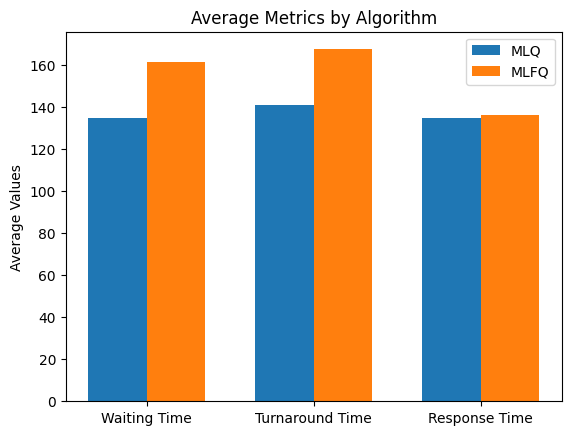
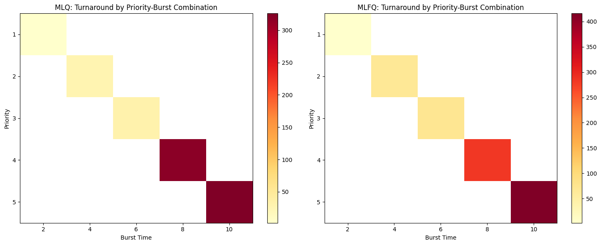
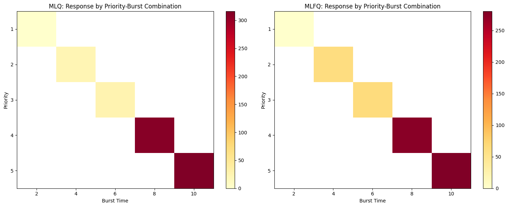
- MLFQ muestra un tiempo de respuesta ligeramente mejor para procesos de baja prioridad

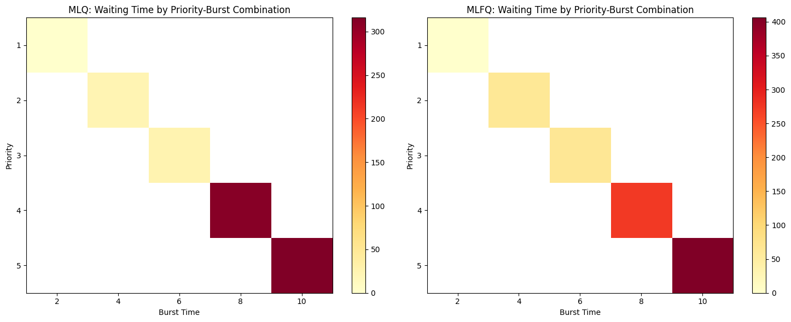
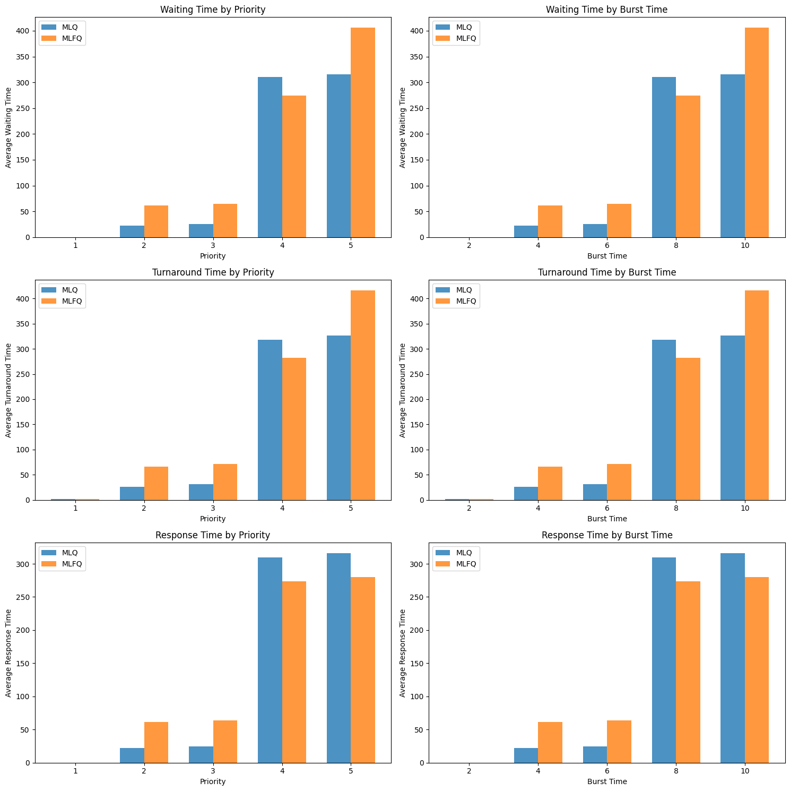

Orden de ejecución:
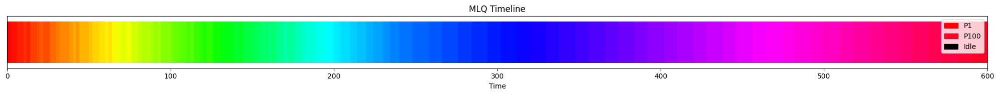
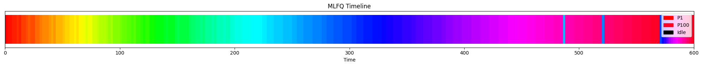


## Conjunto de Prueba 2: Conjunto Grande de Procesos Variados

Analizar un conjunto de datos más grande con prioridades diversas (1-5), tiempos de llegada (0-200) y burst time (1-100) revela las verdaderas fortalezas de cada algoritmo:
Archivo: metrics/examples/processes_random.txt

**Métricas Promedio:**

| Métrica | MLQ | MLFQ |
|---------|-----|------|
| Tiempo de Espera | 2578.28 | 2971.02 |
| Tiempo de Retorno | 2627.42 | 3020.16 |
| Tiempo de Respuesta | 1895.50 | 383.06 |

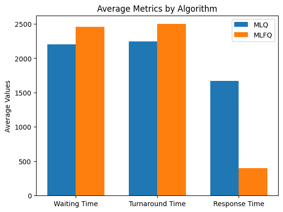

**Hallazgos Clave:**
- **MLFQ sobresale en tiempo de respuesta** (383.06 vs 11895.50) - significativamente mejor para procesos interactivos
- **MLQ sobresale en tiempos de espera/retorno** - mejor para procesamiento por lotes
- El mecanismo de envejecimiento de MLFQ previene la inanición pero la degradación aumenta el tiempo de espera general
- La orientación por prioridad de MLQ ayuda a que los procesos largos de alta prioridad tengan mejores métricas


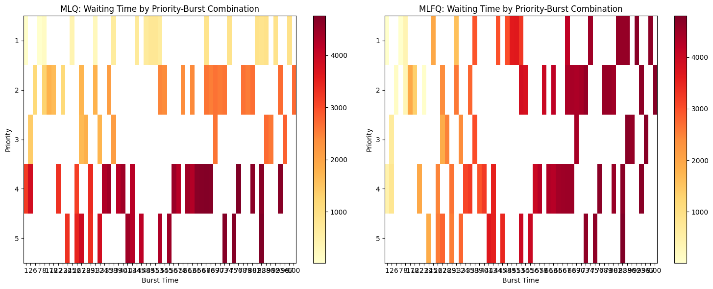
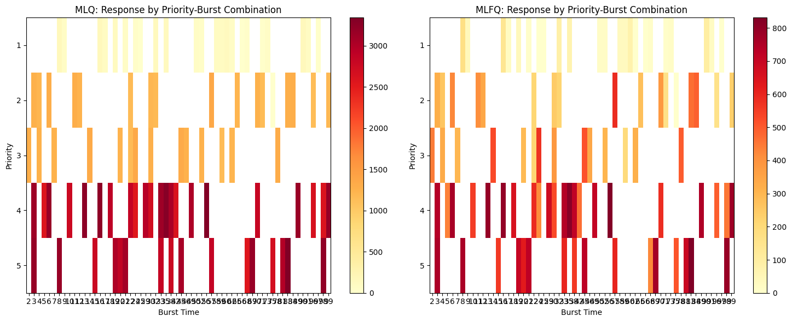
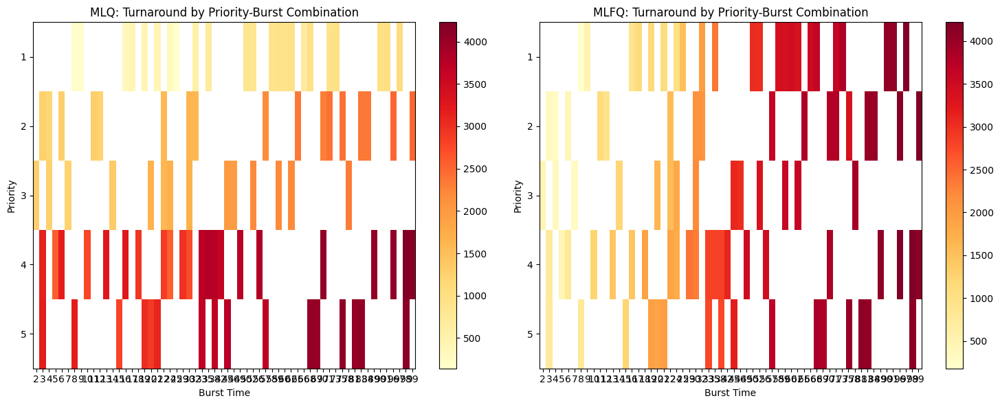

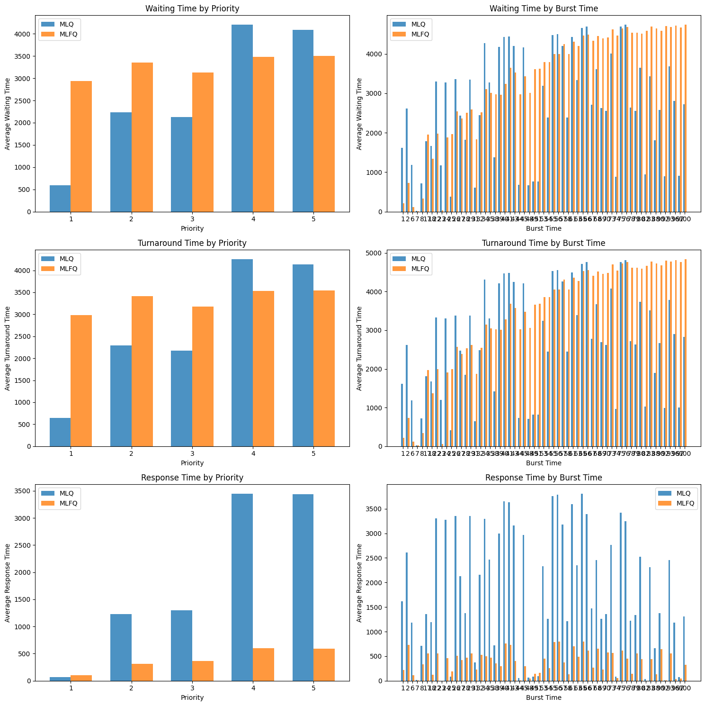


Orden de ejecución:
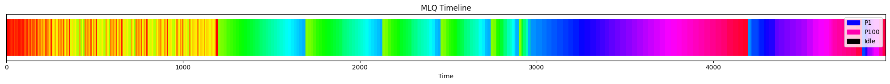
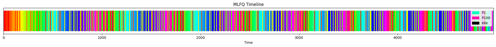
## Conclusiones

### Compensaciones de Rendimiento

**MLFQ** inicia nuevos procesos rápidamente pero toma más tiempo para completar todos los procesos en general.

**MLQ** completa más procesos en menos tiempo total pero puede hacer que algunos procesos esperen más antes de iniciar.

### Usa MLFQ cuando:
- Los sistemas interactivos/responsivos son prioridad
- Los procesos cortos necesitan tiempos de respuesta rápidos
- Prevenir la inanición es crítico
- La experiencia del usuario importa más que el tiempo total de completación

### Usa MLQ cuando:
- Las prioridades de los procesos están bien definidas
- El rendimiento es más importante que el tiempo de respuesta
- Los procesos de alta prioridad necesitan rendimiento garantizado
- El sistema se usa para procesamiento por lotes en lugar de tareas interactivas


## Referencias

Operating System Concepts 10th Ed "ABRAHAM SILBERSCHATZ PETER BAER GALVIN GREG GAGNE"